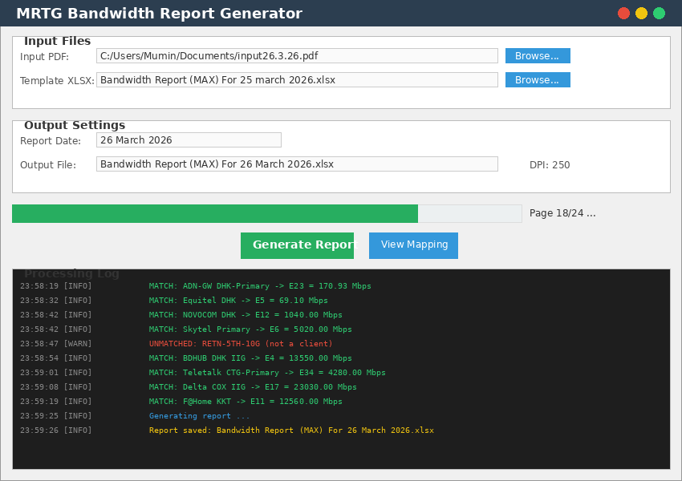
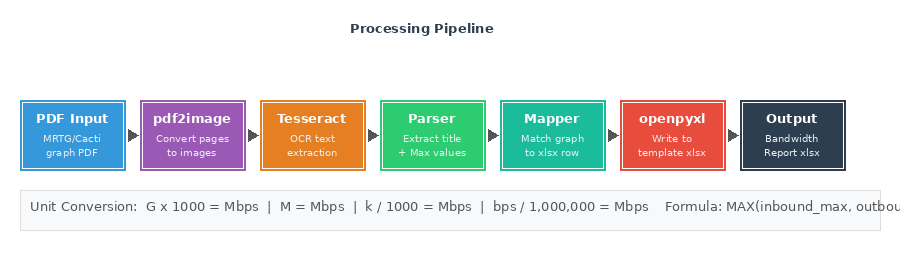
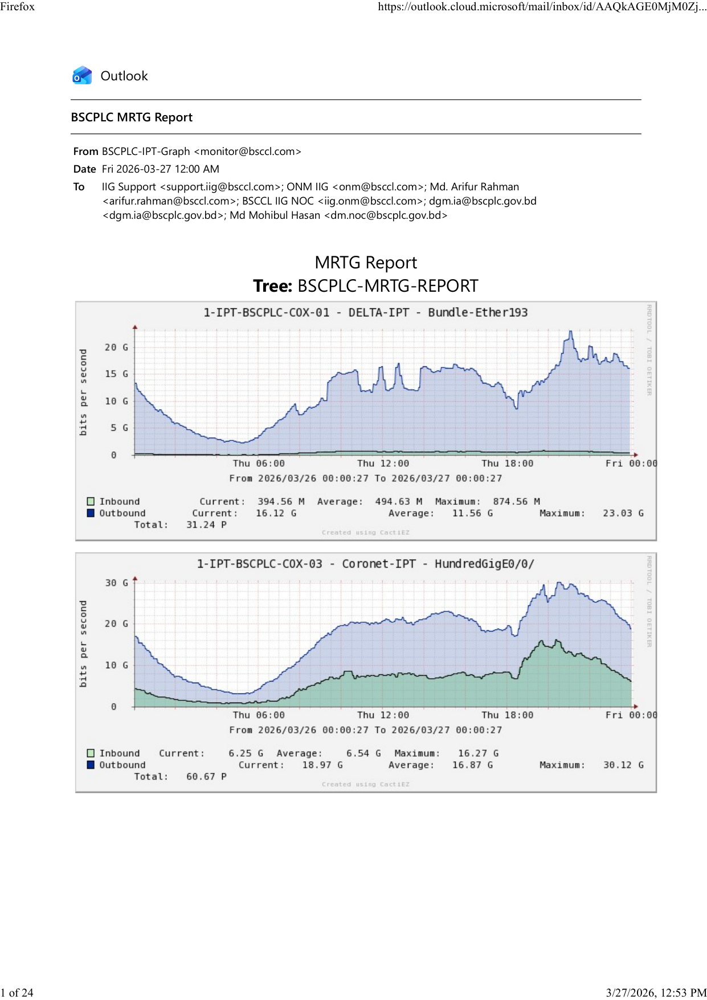
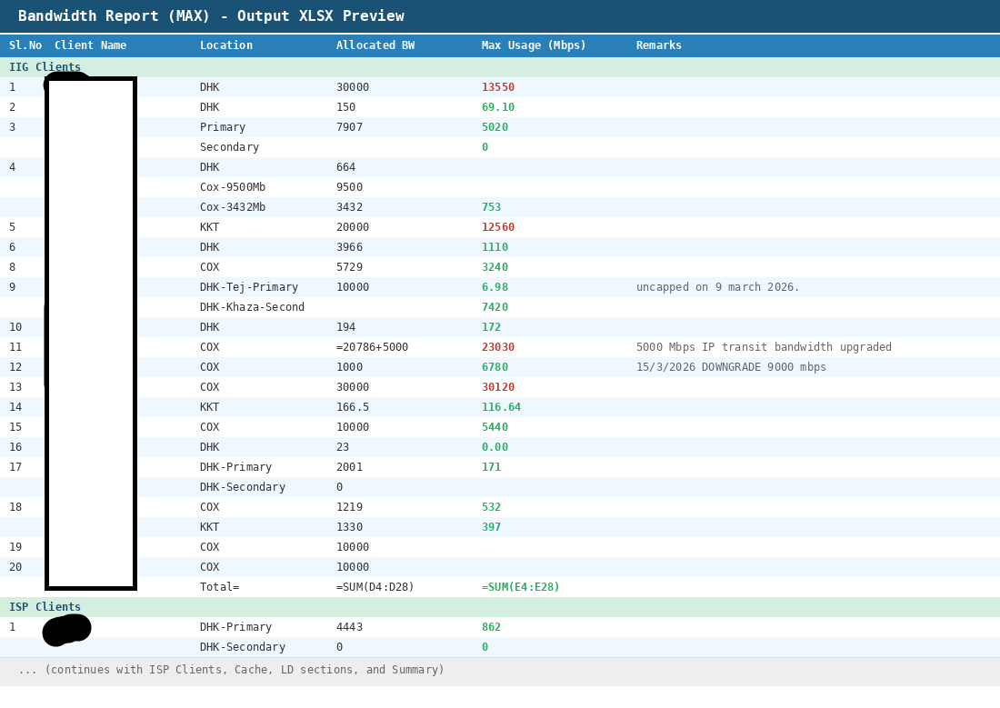

# Daily Bandwidth Report Generator from PDF to OCR to XLSX Tool

A Python desktop tool that automatically extracts bandwidth usage data from MRTG/Cacti graph PDFs and generates daily Bandwidth Report (MAX) Excel spreadsheets.



---

## How It Works



1. **PDF Input** — Accepts MRTG/Cacti daily graph PDFs (typically emailed from monitoring systems)
2. **Image Conversion** — Converts each PDF page to high-resolution images using `pdf2image` + Poppler
3. **OCR Extraction** — Runs Tesseract OCR to extract text from graph images (titles, statistics)
4. **Stats Parsing** — Parses Inbound/Outbound Maximum values with automatic unit detection (G/M/k/bps)
5. **OCR Correction** — Two-layer auto-correction: (a) pre-conversion detection of dropped decimal points in unit-bearing values (e.g. "90911 M" → "909.11 M") using digit-count heuristics, and (b) post-conversion sanity checking against allocated bandwidth with per-direction suspect tracking to avoid over-correcting legitimate low-traffic readings
6. **Graph-to-Row Mapping** — Matches each graph's client name to the correct spreadsheet row using configurable regex patterns + fuzzy token matching as fallback
7. **Excel Generation** — Writes `MAX(inbound_max, outbound_max)` values into the template spreadsheet with traffic-light colour coding and cell borders, preserving all existing formulas. A post-save XML patch adds the `applyFill="1"` and `applyBorder="1"` attributes that openpyxl omits by default, ensuring fills and borders render correctly in Excel
8. **Batch Processing** — Optionally process an entire directory of daily PDFs in one run (GUI Batch Mode tab or `--batch DIR` CLI flag); report dates are auto-detected from each PDF filename

---

## Sample Input (MRTG Graph PDF)

Each page of the input PDF contains 2-3 MRTG/Cacti bandwidth graphs with Inbound/Outbound statistics:



*Each graph shows traffic over 24 hours with Current, Average, and Maximum values for Inbound and Outbound.*


---

## Sample Output (Bandwidth Report XLSX)

The generated Excel report contains Maximum Usage in Mbps for each client, organized by category:



*Cells are colour-coded by utilisation vs allocated bandwidth:*

| Colour | Meaning |
|--------|---------|
| Green | ≤ 70% of allocation — healthy |
| Amber | 71–90% — getting close |
| Orange | 91–100% — near limit |
| Red | > 100% — exceeded allocation |
| Blue | Value was auto-corrected by OCR decimal-drop fix — review advised |
| Yellow (F col) | No graph matched for this client row |

*All data cells (A–F) have thin borders for readability. Section headers (IIG Clients, ISP Clients, etc.) are styled dark green. Formulas for totals and summaries are preserved from the template.*

---

## Requirements

| Component | Purpose |
|-----------|---------|
| Python 3.8+ | Runtime |
| Tesseract OCR | Text recognition from graph images |
| Poppler (pdftoppm) | PDF to image conversion |
| tkinter | GUI toolkit (included with Python on macOS/Windows; separate package on some Linux distros) |
| openpyxl | Excel file reading/writing |
| pdf2image | PDF page rendering |
| pytesseract | Python wrapper for Tesseract |
| Pillow | Image processing |
| playwright | Browser automation for daily pipeline (optional — only needed for `auto_report.py`) |
| python-dotenv | Environment variable loading (optional — only needed for `auto_report.py`) |

---

## Automated Installation Scripts

Copy and paste the script for your OS into a terminal. Each script installs **all** system and Python dependencies from scratch on a clean machine.

### macOS

```bash
#!/usr/bin/env bash
set -euo pipefail

echo "=== MRTG Bandwidth Report — macOS Installer ==="

# Clone repository
INSTALL_DIR="$HOME/BSCPLC-mrtg-bandwidth-report"
echo "[1/6] Cloning repository..."
if [ -d "$INSTALL_DIR" ]; then
    echo "  Directory already exists, pulling latest..."
    cd "$INSTALL_DIR" && git pull
else
    git clone https://github.com/muminurbsccl/BSCPLC-mrtg-bandwidth-report.git "$INSTALL_DIR"
    cd "$INSTALL_DIR"
fi

# Install Homebrew if not present
if ! command -v brew &>/dev/null; then
    echo "[2/6] Installing Homebrew..."
    /bin/bash -c "$(curl -fsSL https://raw.githubusercontent.com/Homebrew/install/HEAD/install.sh)"
    # Add brew to PATH for Apple Silicon and Intel
    if [ -f /opt/homebrew/bin/brew ]; then
        eval "$(/opt/homebrew/bin/brew shellenv)"
    elif [ -f /usr/local/bin/brew ]; then
        eval "$(/usr/local/bin/brew shellenv)"
    fi
else
    echo "[2/6] Homebrew already installed."
fi

# Install Python, Tesseract, Poppler
echo "[3/6] Installing system packages (Python, Tesseract, Poppler)..."
brew install python tesseract poppler

# Install Python dependencies
echo "[4/6] Installing Python packages..."
python3 -m pip install --upgrade pip
python3 -m pip install openpyxl pdf2image pytesseract Pillow playwright python-dotenv

# Install Playwright browser for automation
echo "[5/6] Installing Playwright Chromium..."
python3 -m playwright install chromium

# Verify
echo "[6/6] Verifying installation..."
python3 --version
tesseract --version | head -1
pdftoppm -v 2>&1 | head -1
python3 -c "import openpyxl, pdf2image, pytesseract, PIL, playwright; print('All Python packages OK')"

echo ""
echo "=== Installation complete! ==="
echo "Installed to: $INSTALL_DIR"
echo ""
echo "--- GUI / CLI Mode ---"
echo "Run:  cd $INSTALL_DIR && python3 mrtg_bandwidth_report.py"
echo ""
echo "--- Full Automation Setup ---"
echo "1. Create a .env file in the project root:"
echo "   OUTLOOK_EMAIL=your_email@example.com"
echo "   OUTLOOK_PASSWORD=your_password"
echo "   REPORT_RECIPIENT=recipient@example.com"
echo "   TEMPLATE_PATH=/path/to/template.xlsx"
echo ""
echo "2. Test manually:  python3 auto_report.py"
echo ""
echo "3. Schedule daily (cron - runs at 12:05 AM):"
echo "   (crontab -l 2>/dev/null; echo \"5 0 * * * cd $INSTALL_DIR && python3 auto_report.py >> auto_report.log 2>&1\") | crontab -"
echo ""
echo "The pipeline: Outlook login → PDF download → OCR report → email delivery"
```

### Linux (Ubuntu / Debian)

```bash
#!/usr/bin/env bash
set -euo pipefail

echo "=== MRTG Bandwidth Report — Ubuntu/Debian Installer ==="

# Clone repository
INSTALL_DIR="$HOME/BSCPLC-mrtg-bandwidth-report"
echo "[1/7] Cloning repository..."
if [ -d "$INSTALL_DIR" ]; then
    echo "  Directory already exists, pulling latest..."
    cd "$INSTALL_DIR" && git pull
else
    git clone https://github.com/muminurbsccl/BSCPLC-mrtg-bandwidth-report.git "$INSTALL_DIR"
    cd "$INSTALL_DIR"
fi

# Update package lists
echo "[2/7] Updating package lists..."
sudo apt update

# Install Python, Tesseract, Poppler, tkinter
echo "[3/7] Installing system packages..."
sudo apt install -y python3 python3-pip python3-venv python3-tk \
    tesseract-ocr poppler-utils

# Install Python dependencies
echo "[4/7] Installing Python packages..."
python3 -m pip install --upgrade pip --break-system-packages 2>/dev/null \
    || python3 -m pip install --upgrade pip
python3 -m pip install openpyxl pdf2image pytesseract Pillow playwright python-dotenv --break-system-packages 2>/dev/null \
    || python3 -m pip install openpyxl pdf2image pytesseract Pillow playwright python-dotenv

# Install Playwright browser for automation
echo "[5/7] Installing Playwright Chromium..."
python3 -m playwright install chromium

# Verify
echo "[6/7] Verifying installation..."
python3 --version
tesseract --version 2>&1 | head -1
pdftoppm -v 2>&1 | head -1
python3 -c "import openpyxl, pdf2image, pytesseract, PIL, playwright; print('All Python packages OK')"

echo ""
echo "[7/7] Setup complete!"
echo "=== Installation complete! ==="
echo "Installed to: $INSTALL_DIR"
echo ""
echo "--- GUI / CLI Mode ---"
echo "Run:  cd $INSTALL_DIR && python3 mrtg_bandwidth_report.py"
echo ""
echo "--- Full Automation Setup ---"
echo "1. Create a .env file in the project root:"
echo "   OUTLOOK_EMAIL=your_email@example.com"
echo "   OUTLOOK_PASSWORD=your_password"
echo "   REPORT_RECIPIENT=recipient@example.com"
echo "   TEMPLATE_PATH=/path/to/template.xlsx"
echo ""
echo "2. Test manually:  python3 auto_report.py"
echo ""
echo "3. Schedule daily (cron - runs at 12:05 AM):"
echo "   (crontab -l 2>/dev/null; echo \"5 0 * * * cd $INSTALL_DIR && python3 auto_report.py >> auto_report.log 2>&1\") | crontab -"
echo ""
echo "The pipeline: Outlook login → PDF download → OCR report → email delivery"
```

### Linux (Fedora / RHEL / CentOS)

```bash
#!/usr/bin/env bash
set -euo pipefail

echo "=== MRTG Bandwidth Report — Fedora/RHEL Installer ==="

# Clone repository
INSTALL_DIR="$HOME/BSCPLC-mrtg-bandwidth-report"
echo "[1/6] Cloning repository..."
if [ -d "$INSTALL_DIR" ]; then
    echo "  Directory already exists, pulling latest..."
    cd "$INSTALL_DIR" && git pull
else
    git clone https://github.com/muminurbsccl/BSCPLC-mrtg-bandwidth-report.git "$INSTALL_DIR"
    cd "$INSTALL_DIR"
fi

# Install Python, Tesseract, Poppler, tkinter
echo "[2/6] Installing system packages..."
sudo dnf install -y python3 python3-pip python3-tkinter \
    tesseract poppler-utils

# Install Python dependencies
echo "[3/6] Installing Python packages..."
python3 -m pip install --upgrade pip
python3 -m pip install openpyxl pdf2image pytesseract Pillow playwright python-dotenv

# Install Playwright browser for automation
echo "[4/6] Installing Playwright Chromium..."
python3 -m playwright install chromium

# Verify
echo "[5/6] Verifying installation..."
python3 --version
tesseract --version 2>&1 | head -1
pdftoppm -v 2>&1 | head -1
python3 -c "import openpyxl, pdf2image, pytesseract, PIL, playwright; print('All Python packages OK')"

echo ""
echo "[6/6] Setup complete!"
echo "=== Installation complete! ==="
echo "Installed to: $INSTALL_DIR"
echo ""
echo "--- GUI / CLI Mode ---"
echo "Run:  cd $INSTALL_DIR && python3 mrtg_bandwidth_report.py"
echo ""
echo "--- Full Automation Setup ---"
echo "1. Create a .env file in the project root:"
echo "   OUTLOOK_EMAIL=your_email@example.com"
echo "   OUTLOOK_PASSWORD=your_password"
echo "   REPORT_RECIPIENT=recipient@example.com"
echo "   TEMPLATE_PATH=/path/to/template.xlsx"
echo ""
echo "2. Test manually:  python3 auto_report.py"
echo ""
echo "3. Schedule daily (cron - runs at 12:05 AM):"
echo "   (crontab -l 2>/dev/null; echo \"5 0 * * * cd $INSTALL_DIR && python3 auto_report.py >> auto_report.log 2>&1\") | crontab -"
echo ""
echo "The pipeline: Outlook login → PDF download → OCR report → email delivery"
```

### Linux (Arch / Manjaro)

```bash
#!/usr/bin/env bash
set -euo pipefail

echo "=== MRTG Bandwidth Report — Arch Linux Installer ==="

# Clone repository
INSTALL_DIR="$HOME/BSCPLC-mrtg-bandwidth-report"
echo "[1/6] Cloning repository..."
if [ -d "$INSTALL_DIR" ]; then
    echo "  Directory already exists, pulling latest..."
    cd "$INSTALL_DIR" && git pull
else
    git clone https://github.com/muminurbsccl/BSCPLC-mrtg-bandwidth-report.git "$INSTALL_DIR"
    cd "$INSTALL_DIR"
fi

# Install Python, Tesseract, Poppler, tk
echo "[2/6] Installing system packages..."
sudo pacman -Syu --noconfirm python python-pip tk tesseract poppler

# Install Python dependencies
echo "[3/6] Installing Python packages..."
python -m pip install --upgrade pip --break-system-packages
python -m pip install openpyxl pdf2image pytesseract Pillow playwright python-dotenv --break-system-packages

# Install Playwright browser for automation
echo "[4/6] Installing Playwright Chromium..."
python -m playwright install chromium

# Verify
echo "[5/6] Verifying installation..."
python --version
tesseract --version 2>&1 | head -1
pdftoppm -v 2>&1 | head -1
python -c "import openpyxl, pdf2image, pytesseract, PIL, playwright; print('All Python packages OK')"

echo ""
echo "[6/6] Setup complete!"
echo "=== Installation complete! ==="
echo "Installed to: $INSTALL_DIR"
echo ""
echo "--- GUI / CLI Mode ---"
echo "Run:  cd $INSTALL_DIR && python mrtg_bandwidth_report.py"
echo ""
echo "--- Full Automation Setup ---"
echo "1. Create a .env file in the project root:"
echo "   OUTLOOK_EMAIL=your_email@example.com"
echo "   OUTLOOK_PASSWORD=your_password"
echo "   REPORT_RECIPIENT=recipient@example.com"
echo "   TEMPLATE_PATH=/path/to/template.xlsx"
echo ""
echo "2. Test manually:  python auto_report.py"
echo ""
echo "3. Schedule daily (cron - runs at 12:05 AM):"
echo "   (crontab -l 2>/dev/null; echo \"5 0 * * * cd $INSTALL_DIR && python auto_report.py >> auto_report.log 2>&1\") | crontab -"
echo ""
echo "The pipeline: Outlook login → PDF download → OCR report → email delivery"
```

### Windows (PowerShell — recommended)

Open **PowerShell as Administrator** and run:

```powershell
Write-Host "=== MRTG Bandwidth Report - Windows Installer ===" -ForegroundColor Cyan

# Clone repository
$InstallDir = "E:\app\Daily_BW_report"
Write-Host "[1/6] Cloning repository..." -ForegroundColor Yellow
if (Test-Path $InstallDir) {
    Write-Host "  Directory already exists, pulling latest..."
    Set-Location $InstallDir; git pull
} else {
    New-Item -ItemType Directory -Path (Split-Path $InstallDir) -Force | Out-Null
    git clone https://github.com/muminurbsccl/BSCPLC-mrtg-bandwidth-report.git $InstallDir
    Set-Location $InstallDir
}

# Install winget packages (Python, Tesseract, Poppler)
Write-Host "[2/6] Installing system packages via winget..." -ForegroundColor Yellow

$packages = @(
    @{ Id = "Python.Python.3.11";       Name = "Python 3.11" },
    @{ Id = "UB-Mannheim.TesseractOCR"; Name = "Tesseract OCR" },
    @{ Id = "oschwartz10612.Poppler";    Name = "Poppler" }
)

foreach ($pkg in $packages) {
    $installed = winget list --id $pkg.Id 2>$null | Select-String $pkg.Id
    if ($installed) {
        Write-Host "  $($pkg.Name) already installed." -ForegroundColor Green
    } else {
        Write-Host "  Installing $($pkg.Name)..."
        winget install --id $pkg.Id --accept-source-agreements --accept-package-agreements
    }
}

# Refresh PATH so newly installed commands are available
Write-Host "[3/6] Refreshing PATH..." -ForegroundColor Yellow
$env:Path = [System.Environment]::GetEnvironmentVariable("Path","Machine") + ";" + `
            [System.Environment]::GetEnvironmentVariable("Path","User")

# Install Python packages
Write-Host "[4/6] Installing Python packages..." -ForegroundColor Yellow
py -3 -m pip install --upgrade pip
py -3 -m pip install openpyxl pdf2image pytesseract Pillow playwright python-dotenv

# Install Playwright browser for automation
Write-Host "[5/6] Installing Playwright Chromium..." -ForegroundColor Yellow
py -3 -m playwright install chromium

# Verify
Write-Host "[6/6] Verifying installation..." -ForegroundColor Yellow
py -3 --version
tesseract --version 2>$null | Select-Object -First 1
pdftoppm -v 2>&1 | Select-Object -First 1
py -3 -c "import openpyxl, pdf2image, pytesseract, PIL, playwright; print('All Python packages OK')"

Write-Host ""
Write-Host "=== Installation complete! ===" -ForegroundColor Cyan
Write-Host "Installed to: $InstallDir"
Write-Host ""
Write-Host "--- GUI / CLI Mode ---" -ForegroundColor Green
Write-Host "Run:  cd $InstallDir; py -3 mrtg_bandwidth_report.py"
Write-Host "  or: double-click run.bat"
Write-Host ""
Write-Host "--- Full Automation Setup ---" -ForegroundColor Green
Write-Host "1. Create a .env file in the project root with:"
Write-Host "   OUTLOOK_EMAIL=your_email@example.com"
Write-Host "   OUTLOOK_PASSWORD=your_password"
Write-Host "   REPORT_RECIPIENT=recipient@example.com"
Write-Host "   TEMPLATE_PATH=D:\path\to\template.xlsx"
Write-Host ""
Write-Host "2. Test manually:  py -3 auto_report.py"
Write-Host ""
Write-Host "3. Schedule daily (run setup_scheduler.bat as Admin, or):"
Write-Host "   schtasks /create /tn `"MRTG_Auto_Report`" /tr `"py -3 $InstallDir\auto_report.py`" /sc daily /st 00:05 /f"
Write-Host ""
Write-Host "Pipeline: Outlook login -> PDF download -> OCR report -> email delivery"
```

### Windows (Chocolatey — alternative)

Open **PowerShell as Administrator** and run:

```powershell
# Clone repository
$InstallDir = "E:\app\Daily_BW_report"
if (Test-Path $InstallDir) {
    Set-Location $InstallDir; git pull
} else {
    New-Item -ItemType Directory -Path (Split-Path $InstallDir) -Force | Out-Null
    git clone https://github.com/muminurbsccl/BSCPLC-mrtg-bandwidth-report.git $InstallDir
    Set-Location $InstallDir
}

# Install Chocolatey if not present
if (-not (Get-Command choco -ErrorAction SilentlyContinue)) {
    Set-ExecutionPolicy Bypass -Scope Process -Force
    [System.Net.ServicePointManager]::SecurityProtocol = [System.Net.SecurityProtocolType]::Tls12
    Invoke-Expression ((New-Object System.Net.WebClient).DownloadString('https://community.chocolatey.org/install.ps1'))
}

# Install system packages
choco install python3 tesseract poppler -y

# Refresh PATH
refreshenv

# Install Python packages
py -3 -m pip install --upgrade pip
py -3 -m pip install openpyxl pdf2image pytesseract Pillow playwright python-dotenv
py -3 -m playwright install chromium

Write-Host "Installation complete!" -ForegroundColor Cyan
Write-Host "GUI/CLI: py -3 mrtg_bandwidth_report.py"
Write-Host "Automation: Create .env, then py -3 auto_report.py (see full installer output above)"
```

---

## Quick Install (one-liner)

If you already have Python, Git, and a package manager installed:

**macOS:**
```bash
git clone https://github.com/muminurbsccl/BSCPLC-mrtg-bandwidth-report.git && cd BSCPLC-mrtg-bandwidth-report && brew install tesseract poppler && pip3 install openpyxl pdf2image pytesseract Pillow playwright python-dotenv && python3 -m playwright install chromium && python3 mrtg_bandwidth_report.py
```

**Ubuntu / Debian:**
```bash
git clone https://github.com/muminurbsccl/BSCPLC-mrtg-bandwidth-report.git && cd BSCPLC-mrtg-bandwidth-report && sudo apt install -y tesseract-ocr poppler-utils python3-tk && pip3 install openpyxl pdf2image pytesseract Pillow playwright python-dotenv && python3 -m playwright install chromium && python3 mrtg_bandwidth_report.py
```

**Windows (winget — run in PowerShell):**
```powershell
git clone https://github.com/muminurbsccl/BSCPLC-mrtg-bandwidth-report.git; cd BSCPLC-mrtg-bandwidth-report; winget install UB-Mannheim.TesseractOCR oschwartz10612.Poppler; pip install openpyxl pdf2image pytesseract Pillow playwright python-dotenv; python -m playwright install chromium; py -3 mrtg_bandwidth_report.py
```

---

## Usage

### GUI Mode (default)

```bash
python mrtg_bandwidth_report.py
```

On Windows you can also double-click **`run.bat`**, which auto-detects Tesseract and Poppler from common install paths (winget, Chocolatey, manual).

Opens a graphical interface with two tabs:

**Single File tab**
- Browse and select the input PDF and template XLSX
- Set the report date
- Adjust OCR DPI (higher = better accuracy, slower processing)
- View real-time processing logs with matched/unmatched graphs
- Inspect the graph-to-row mapping table
- **Copy Unmatched Entries** — after each run, click this button to copy a list of client rows that had no matching graph in the PDF (tab-separated, paste directly into Excel or Notepad)

**Batch Mode tab**
- Select a directory containing multiple daily PDF files
- Optionally set a separate output directory for the generated XLSX files
- Click **Run Batch** — dates are auto-detected from each PDF filename; a report is generated for every PDF found

**Shared options** (apply to both tabs):
- **Warn duplicates** checkbox — logs a warning whenever two graphs match the same row, showing both values before the higher one wins
- All settings (template path, DPI, warn-duplicates, batch directories) are saved automatically to `~/.mrtg_report_config.json` and restored on next launch

### CLI Mode

**Single file:**
```bash
python mrtg_bandwidth_report.py --cli \
    --pdf input26.3.26.pdf \
    --template "Bandwidth Report (MAX) For 25 march 2026.xlsx" \
    --date "26 March 2026" \
    --output "Bandwidth Report (MAX) For 26 March 2026.xlsx"
```

**Batch (whole directory of PDFs):**
```bash
python mrtg_bandwidth_report.py --cli \
    --batch /path/to/pdfs/ \
    --template "Bandwidth Report (MAX) For 25 march 2026.xlsx" \
    --output-dir /path/to/reports/
```

**CLI Options:**

| Flag | Description | Default |
|------|-------------|---------|
| `--pdf` | Input PDF with MRTG graphs (single-file mode) | *required unless `--batch`* |
| `--batch DIR` | Process all PDFs in a directory; dates auto-detected from filenames | - |
| `--template` | Template xlsx file (previous day) | *required* |
| `--date` | Report date string (single-file; auto-detected in batch) | Today's date |
| `--output` | Output xlsx path (single-file) | Auto-generated |
| `--output-dir DIR` | Output directory for batch-generated reports | Same dir as each PDF |
| `--dpi` | PDF render DPI | 250 |
| `--warn-duplicates` | Log a warning when two graphs map to the same row | off |
| `--debug-json` | Save extraction debug data to JSON (single-file) | - |
| `--debug-full` | Include raw per-page OCR text in debug JSON | off |

---

## Customizing the Graph Mapping

The mapping between MRTG graph titles and spreadsheet rows is configured in the `GRAPH_TO_ROW_MAP` list at the top of the script. Each entry is a tuple:

```python
(r"regex_pattern", "E4", "Description")
```

- **regex_pattern** — Case-insensitive regex matched against the client name extracted from the graph title
- **E4** — The Excel cell reference (always column E + row number)
- **Description** — Human-readable name for logging

**Example:** To add a new client "NewTelco" at row 29:
```python
(r"NewTelco|NEW.?TELCO", "E29", "NewTelco COX"),
```

The graph title format from MRTG is typically:
```
{prefix}-{router} - {CLIENT-NAME} - {interface}
```
The script extracts the CLIENT-NAME portion and matches it against your patterns.

---

## Spreadsheet Structure

The template xlsx follows this layout:

| Section | Rows | Description |
|---------|------|-------------|
| IIG Clients | 4-28 | International Internet Gateway clients |
| ISP Clients | 31-51 | Internet Service Provider clients |
| Cache | 54-55 | Cache bandwidth (CDN/Cloudflare) |
| LD Clients | 58-67 | Limited Destination bandwidth clients |
| Summary | 70-74 | Auto-calculated totals (formulas preserved) |

**Key columns:** A=Sl.No, B=Client, C=Location, D=Allocated BW, E=Max Usage (Mbps), F=Remarks

---

## Accuracy Notes

This tool uses OCR to read text from graph images, which has inherent limitations:

- **Typical accuracy: ~80-90%** of values extracted correctly without correction; higher with auto-correction
- Unit letters (M/G/k) may be missed or misread by OCR — full unit strings (`Mbps`, `Gbps`, `kbps`) are also handled automatically
- Common OCR character substitutions (`@` → `0`, `[` → `I`, `|` → `l`, `]` → `)`) are automatically corrected before pattern matching
- **OCR-tolerant direction matching** — garbled direction keywords (`lnbound`, `0utbound`, `1nbound`) are detected and matched correctly
- **Two-layer decimal-drop correction:**
  - *Pre-conversion (digit-pattern)*: Detects dropped decimal points in values with units (e.g. OCR reads "90911 M" instead of "909.11 M") by examining digit counts — 4+ digits for Mbps, 3+ digits for Gbps — and reinserting the decimal at plausible positions. No allocated bandwidth needed.
  - *Post-conversion (allocation-based)*: Values exceeding allocated bandwidth (>10x) are automatically divided until plausible (e.g. 293,000 Mbps → 14,560 Mbps). Corrected cells are highlighted blue.
  - *Per-direction suspect tracking*: Each traffic direction (inbound/outbound) is independently tracked for missing units, so a correctly-parsed direction is never over-corrected because the other direction lost its unit.
  - *False-positive safeguards*: (a) If only one direction triggers correction and the other direction had a valid unit reading, the correction is reverted — the valid reading is ground truth. (b) If both directions are "recovered" from near-zero values, both are reverted — this pattern indicates an idle link, not a double OCR error. (c) If only one direction is corrected and the result drops below the other direction's raw value, the correction is reverted to preserve legitimate traffic bursts.
- **Duplicate row handling:** When two graphs map to the same spreadsheet row, the higher `MAX(in, out)` value wins. Enable **Warn duplicates** (GUI checkbox or `--warn-duplicates` CLI flag) to log each overwrite with both values and their source pages for review
- **Cache cell accumulation:** Multiple cache graphs (e.g. Exabyte TEJ + DC + EDGENEXT) are summed rather than taking the maximum, for accurate totals
- **Expanded interface detection:** Recognises `GigabitEthernet`, `Gi0/0`, `Te0/0`, `FortyGigE`, `TwentyFiveGig` in addition to `Bundle-Ether`, `TenGigE`, `HundredGigE`
- **Fuzzy fallback matching:** 65-entry token map covers all client rows as a last resort when regex patterns fail
- Some graph titles may not match patterns — unmatched rows are highlighted yellow in the F column as a manual review flag; use the **Copy Unmatched Entries** button to export the list
- Graphs marked "Could not open!" in the PDF will have no data (this is a Cacti error, not a tool issue)

**Always manually verify the output** against the source PDF before distributing the report.

---

## Automated Daily Report Pipeline

The `auto_report.py` script fully automates the daily bandwidth report workflow — from fetching the email to delivering the final spreadsheet.

### How It Works

```
12:01 AM  →  MRTG report email arrives in Outlook
12:05 AM  →  Windows Task Scheduler triggers auto_report.py
              1. Playwright Chromium opens Outlook web, logs in
              2. Searches for "BSCPLC MRTG Report" email
              3. Opens the email and saves it as PDF
              4. Runs the OCR report generator on the PDF
              5. Emails the .xlsx report to the configured recipient
```

### Automation Setup

> **Note:** If you ran one of the full installation scripts above, Playwright and python-dotenv are already installed. If not:
> ```bash
> pip install playwright python-dotenv && playwright install chromium
> ```

**1. Create a `.env` file** in the project root (never committed to git):

```
OUTLOOK_EMAIL=your_email@example.com
OUTLOOK_PASSWORD=your_password
REPORT_RECIPIENT=recipient@example.com
TEMPLATE_PATH=D:\path\to\template.xlsx
```

| Variable | Description |
|----------|-------------|
| `OUTLOOK_EMAIL` | Microsoft 365 / Outlook email address used to log in and send the report |
| `OUTLOOK_PASSWORD` | Password for the Outlook account |
| `REPORT_RECIPIENT` | Email address that receives the generated bandwidth report |
| `TEMPLATE_PATH` | Absolute path to the previous day's `.xlsx` template file |

**2. Test it manually:**

```bash
python auto_report.py
```

A Chromium browser window will open, log into Outlook, download the MRTG report email as PDF, run the OCR pipeline, and email the resulting `.xlsx` to the recipient.

**3. Schedule daily execution:**

**Windows** — run `setup_scheduler.bat` as Administrator, or:
```powershell
schtasks /create /tn "MRTG_Auto_Report" /tr "py -3 C:\path\to\auto_report.py" /sc daily /st 00:05 /f
```

**macOS / Linux** — add a cron job (runs at 12:05 AM daily):
```bash
(crontab -l 2>/dev/null; echo "5 0 * * * cd /path/to/project && python3 auto_report.py >> auto_report.log 2>&1") | crontab -
```

### Automation Output

- PDFs saved to `pdfs/` directory (auto-created)
- Reports saved to `reports/` directory (auto-created)
- Report emailed to `REPORT_RECIPIENT` via Outlook SMTP (`smtp.office365.com:587`)

---

## Project Structure

```
mrtg-bandwidth-report/
├── mrtg_bandwidth_report.py    # Main script (GUI + CLI)
├── auto_report.py              # Automated daily pipeline (email → PDF → OCR → report → email)
├── run.bat                     # Windows launcher (auto-detects Tesseract + Poppler)
├── setup_scheduler.bat         # One-click Windows Task Scheduler setup
├── requirements.txt            # Python dependencies
├── tests/
│   ├── __init__.py
│   ├── test_fill_logic.py          # Unit tests for traffic-light fill logic
│   └── test_extraction_fixes.py    # Regression tests for extraction pipeline (49 tests)
├── README.md                   # This file
├── screenshots/                # Documentation images
│   ├── gui_screenshot.png
│   ├── pipeline.png
│   ├── sample_input_pdf.png
│   ├── sample_input_page2.png
│   └── sample_output_xlsx.png
├── .env                        # Credentials (gitignored — create manually)
├── .gitignore
└── LICENSE
```

---

## License

MIT License — free to use, modify, and distribute.
