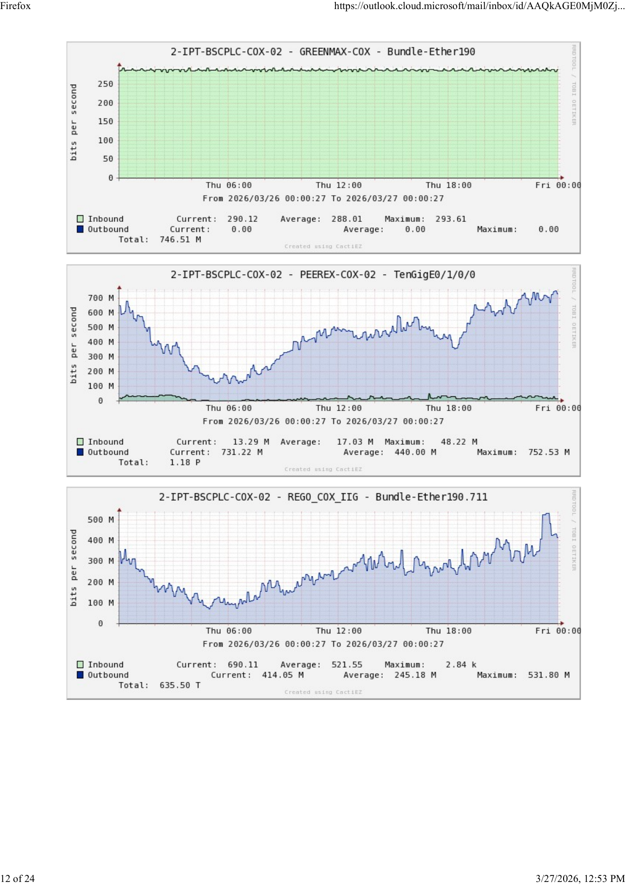

# MRTG Bandwidth Report Generator

A Python desktop tool that automatically extracts bandwidth usage data from MRTG/Cacti graph PDFs and generates daily Bandwidth Report (MAX) Excel spreadsheets.


---

## How It Works


1. **PDF Input** — Accepts MRTG/Cacti daily graph PDFs (typically emailed from monitoring systems)
2. **Image Conversion** — Converts each PDF page to high-resolution images using `pdf2image` + Poppler
3. **OCR Extraction** — Runs Tesseract OCR to extract text from graph images (titles, statistics)
4. **Stats Parsing** — Parses Inbound/Outbound Maximum values with automatic unit detection (G/M/k/bps)
5. **OCR Correction** — Automatically detects and fixes common OCR decimal-drop errors (e.g. "2.93G" read as "293G") using the allocated bandwidth as a sanity ceiling
6. **Graph-to-Row Mapping** — Matches each graph's client name to the correct spreadsheet row using configurable regex patterns + fuzzy token matching as fallback
7. **Excel Generation** — Writes `MAX(inbound_max, outbound_max)` values into the template spreadsheet with traffic-light colour coding, preserving all existing formulas

---

## Sample Input (MRTG Graph PDF)

Each page of the input PDF contains 2-3 MRTG/Cacti bandwidth graphs with Inbound/Outbound statistics:


*Each graph shows traffic over 24 hours with Current, Average, and Maximum values for Inbound and Outbound.*



---

## Sample Output (Bandwidth Report XLSX)

The generated Excel report contains Maximum Usage in Mbps for each client, organized by category:


*Cells are colour-coded by utilisation vs allocated bandwidth:*

| Colour | Meaning |
|--------|---------|
| Green | ≤ 70% of allocation — healthy |
| Amber | 71–90% — getting close |
| Orange | 91–100% — near limit |
| Red | > 100% — exceeded allocation |
| Blue | Value was auto-corrected by OCR decimal-drop fix — review advised |
| Yellow (F col) | No graph matched for this client row |

*Section headers (IIG Clients, ISP Clients, etc.) are styled dark green. Formulas for totals and summaries are preserved from the template.*

---

## Installation

### One-Liner Install

**macOS:**
```bash
brew install tesseract poppler && pip install openpyxl pdf2image pytesseract Pillow
```

**Ubuntu / Debian:**
```bash
sudo apt install -y tesseract-ocr poppler-utils && pip install openpyxl pdf2image pytesseract Pillow
```

**Windows (with Chocolatey):**
```powershell
choco install tesseract poppler && pip install openpyxl pdf2image pytesseract Pillow
```

**Windows (manual):**
1. Download Tesseract from [UB-Mannheim/tesseract](https://github.com/UB-Mannheim/tesseract/wiki) and install
2. Download Poppler from [oschwartz10612/poppler-windows](https://github.com/oschwartz10612/poppler-windows/releases) and add to PATH
3. Run: `pip install openpyxl pdf2image pytesseract Pillow`

### Requirements

| Component | Purpose |
|-----------|---------|
| Python 3.8+ | Runtime |
| Tesseract OCR | Text recognition from graph images |
| Poppler (pdftoppm) | PDF to image conversion |
| openpyxl | Excel file reading/writing |
| pdf2image | PDF page rendering |
| pytesseract | Python wrapper for Tesseract |
| Pillow | Image processing |

---

## Usage

### GUI Mode (default)

```bash
python mrtg_bandwidth_report.py
```

Opens a graphical interface where you can:
- Browse and select the input PDF and template XLSX
- Set the report date
- Adjust OCR DPI (higher = better accuracy, slower processing)
- View real-time processing logs with matched/unmatched graphs
- Inspect the graph-to-row mapping table

### CLI Mode

```bash
python mrtg_bandwidth_report.py --cli \
    --pdf input26.3.26.pdf \
    --template "Bandwidth Report (MAX) For 25 march 2026.xlsx" \
    --date "26 March 2026" \
    --output "Bandwidth Report (MAX) For 26 March 2026.xlsx"
```

**CLI Options:**

| Flag | Description | Default |
|------|-------------|---------|
| `--pdf` | Input PDF with MRTG graphs | *required* |
| `--template` | Template xlsx file (previous day) | *required* |
| `--date` | Report date string | Today's date |
| `--output` | Output xlsx path | Auto-generated |
| `--dpi` | PDF render DPI | 250 |
| `--debug-json` | Save extraction debug data to JSON | - |

---

## Customizing the Graph Mapping

The mapping between MRTG graph titles and spreadsheet rows is configured in the `GRAPH_TO_ROW_MAP` list at the top of the script. Each entry is a tuple:

```python
(r"regex_pattern", "E4", "Description")
```

- **regex_pattern** — Case-insensitive regex matched against the client name extracted from the graph title
- **E4** — The Excel cell reference (always column E + row number)
- **Description** — Human-readable name for logging

**Example:** To add a new client "NewTelco" at row 29:
```python
(r"NewTelco|NEW.?TELCO", "E29", "NewTelco COX"),
```

The graph title format from MRTG is typically:
```
{prefix}-{router} - {CLIENT-NAME} - {interface}
```
The script extracts the CLIENT-NAME portion and matches it against your patterns.

---

## Spreadsheet Structure

The template xlsx follows this layout:

| Section | Rows | Description |
|---------|------|-------------|
| IIG Clients | 4-28 | International Internet Gateway clients |
| ISP Clients | 31-51 | Internet Service Provider clients |
| Cache | 54-55 | Cache bandwidth (CDN/Cloudflare) |
| LD Clients | 58-67 | Limited Destination bandwidth clients |
| Summary | 70-74 | Auto-calculated totals (formulas preserved) |

**Key columns:** A=Sl.No, B=Client, C=Location, D=Allocated BW, E=Max Usage (Mbps), F=Remarks

---

## Accuracy Notes

This tool uses OCR to read text from graph images, which has inherent limitations:

- **Typical accuracy: ~80-90%** of values extracted correctly
- Unit letters (M/G/k) may be missed or misread by OCR
- Common OCR character substitutions (`@` → `0`, `[` → `I`, `l` → `I`) are automatically corrected before pattern matching
- **Decimal-drop correction:** Values wildly exceeding allocated bandwidth (>10×) are automatically corrected by dividing until plausible (e.g. 293,000 Mbps → 14,560 Mbps); corrected cells are highlighted blue
- Some graph titles may not match patterns — unmatched rows are highlighted yellow in the F column as a manual review flag
- Graphs marked "Could not open!" in the PDF will have no data (this is a Cacti error, not a tool issue)

**Always manually verify the output** against the source PDF before distributing the report.

---

## Project Structure

```
mrtg-bandwidth-report/
├── mrtg_bandwidth_report.py    # Main script (GUI + CLI)
├── run.bat                     # Windows launcher (sets Tesseract + Poppler PATH)
├── tests/
│   └── test_fill_logic.py      # Unit tests for traffic-light fill logic
├── README.md                   # This file
├── screenshots/                # Documentation images
│   ├── gui_screenshot.png
│   ├── pipeline.png
│   ├── sample_input_pdf.png
│   ├── sample_input_page2.png
│   └── sample_output_xlsx.png
├── .gitignore
└── LICENSE
```

---

## License

MIT License — free to use, modify, and distribute.
